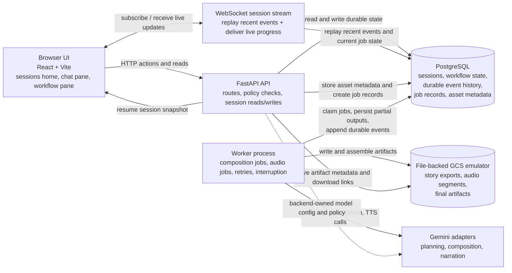

# System Diagram

This diagram shows the intended runtime shape for Storyteller after the core session, worker, and realtime prompts are built. It documents where session resume, durable event history, realtime delivery, and long-running jobs belong.

## Read This Diagram As

- The browser never calls Gemini directly.
- Resume starts from PostgreSQL session state plus durable event history.
- WebSockets deliver progress, but durable state still lives in PostgreSQL and object storage.
- Long-running generation belongs in the worker process, not inside request handlers.
- Artifacts live in object storage while PostgreSQL keeps the references and lifecycle state.

## Soft-Constraint Reminder

Word count, runtime, and chapter count are soft planning hints. They shape prompts and estimates, but the system should favor story quality, bedtime tone, and coherent pacing over exact numeric compliance.
